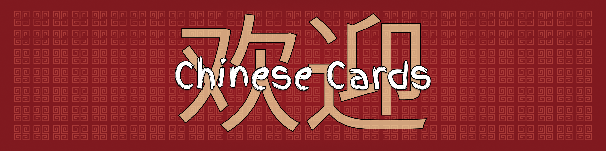

# ChineseCards

 

Chinese Cards was developed to teach the composition of characters of the Chinese language. It has 3 sections: the first one allows you to build a character from the identification of different kinds of elementary strokes. The second exposes the different structures that the characters can have, like left-right, above-middle-below etc. The third shows the variations that a character suffered along history until its current look, with a brief attached explanation of its meaning.
